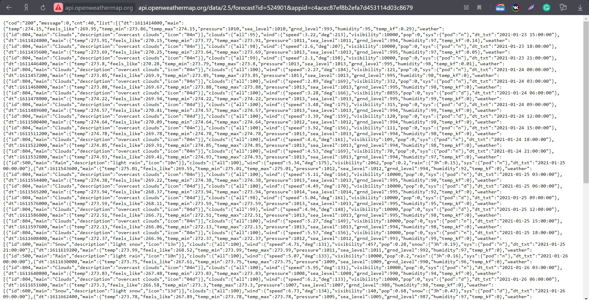
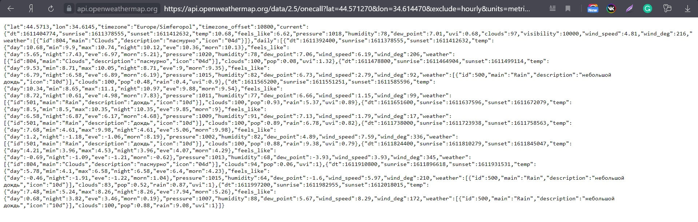
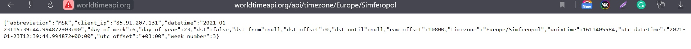
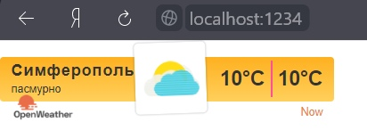
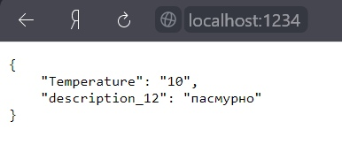
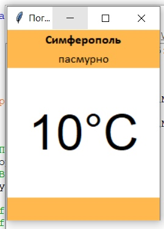

<p align="center">МИНИСТЕРСТВО НАУКИ  И ВЫСШЕГО ОБРАЗОВАНИЯ РОССИЙСКОЙ ФЕДЕРАЦИИ<br>
Федеральное государственное автономное образовательное учреждение высшего образования<br>
"КРЫМСКИЙ ФЕДЕРАЛЬНЫЙ УНИВЕРСИТЕТ им. В. И. ВЕРНАДСКОГО"<br>
ФИЗИКО-ТЕХНИЧЕСКИЙ ИНСТИТУТ<br>
Кафедра компьютерной инженерии и моделирования</p>
<br>

<h3 align="center">Отчёт по лабораторной работе № 1<br> по дисциплине "Программирование"</h3>

<br><br>

<p>студента 1 курса группы ПИ-б-о-203<br>
Петакчяна Мисака Араиковича<br>
направления подготовки 09.03.04 "Программная инженерия"</p>

<br><br>

<table>
<tr><td>Научный руководитель<br> старший преподаватель кафедры<br> компьютерной инженерии и моделирования</td>
<td>(оценка)</td>
<td>Чабанов В.В.</td>
</tr>
</table>
<br><br>

<p align="center">Симферополь, 2020</p>
<hr>

## Цель:


1. Закрепить навыки разработки многофайловыx приложений;
2. Изучить способы работы с API web-сервиса;
3. Изучить процесс сериализации/десериализации данных в/из json;
4. Получить базовое представление о сетевом взаимодействии приложений;

## Постановка задачи
Разработать сервис предоставляющий данные о погоде в городе Симферополе на момент запроса. В качестве источника данных о погоде использовать: http://openweathermap.org/. В состав сервиса входит: серверное приложение на языке С++ и клиентское приложение на языке Python. Серверное приложение (далее Сервер) предназначенное для обслуживания клиентских приложений и минимизации количества запросов к сервису openweathermap.org. Сервер должен обеспечивать возможность получения данных в формате JSON и виде html виджета (для вставки виджета на страницу будет использоваться iframe).
Клиентское приложение должно иметь графический интерфейс отображающий сведения о погоде и возможность обновления данных по требованию пользователя.

## Выполнение работы

### Задание 1

Заходим на сайт http://openweathermap.org/ и регистрируемся. Подтверждаем регистрацию на почте и логинимся на сайте. Переходим в наш аккаунт и генерируем API key. Полученный ключ представлен ниже.

c4acec87ef8b2efa7d453114d03c8679

Далее подставляем наш ключ в ссылку, которая будет имеет следующий вид: http://api.openweathermap.org/data/2.5/forecast?id=524901&appid=c4acec87ef8b2efa7d453114d03c8679

Переходим по созданной ссылке и получаем следующий результат в виде JSON кода.



Рисунок 1.

Далее нам нужно получить прогноз погоды для Симферополя с почасовым интервалом, в градусах Цельсия и на русском языке.

Создаем ссылку и переходим на сайт: https://api.openweathermap.org/data/2.5/onecall?lat=44.571270&lon=34.614470&exclude=hourly&units=metric&lang=ru&appid=c4acec87ef8b2efa7d453114d03c8679



Рисунок 2.

### Задание 2

Запрос для сервера погоды включает в себя город, время которого необходимо получить.



Рисунок 3.

### Задание 3

Сервер имеет следующий код:

```C++
#include <iostream>
#include <cpp_httplib/httplib.h>
#include <nlohmann/json.hpp>
#include <fstream>
#include <string>
#include <math.h>
using namespace httplib;
using json = nlohmann::json;

void gen_response1(const Request& req, Response& res) {
    Client cli("http://worldtimeapi.org");
    auto clientTime = cli.Get("/api/timezone/Europe/Simferopol");
    Client cli1("http://api.openweathermap.org");
    auto clientWeather = cli1.Get("/data/2.5/onecall?lat=44.5653&lon=34.0615&lang=ru&units=metric&exclude=current,minutely,daily,alerts&appid=d77f8cf842259c56c1dcd93e7c5d5228");
    if (clientTime) {
        int error = clientTime->status;
        if (clientTime->status == 200) {

            json time = json::parse(clientTime->body);
            json weather = json::parse(clientWeather->body);
            for (int i = 0; i < 48; i++) {

                if (weather["hourly"][i]["dt"].get<ULONG64>() > time["unixtime"].get<ULONG64>()) {
                    std::ifstream file("123.txt");
                    std::string text;
                    getline(file, text, '\0');
                    file.close();
                    std::string first = "{hourly[i].weather[0].description}";
                    std::string second = "{hourly[i].weather[0].icon}";
                    std::string third = "{hourly[i].temp}";
                    text.replace(text.find(first), first.size(), weather["hourly"][i]["weather"][0]["description"]);
                    text.replace(text.find(second), second.size(), weather["hourly"][i]["weather"][0]["icon"]);
                    text.replace(text.find(third), third.size(), std::to_string(int(round(weather["hourly"][i]["temp"].get<double>()))));
                    text.replace(text.find(third), third.size(), std::to_string(int(round(weather["hourly"][i]["temp"].get<double>()))));
                    res.set_content(text, "text/html;  charset=UTF-8");
                    break;

                }
            }


        }
        else 
        {

            res.set_content(std::to_string(error), "text/plain");
        }
    }
    else  res.set_content("errorq", "text/plain");
}

void gen_response(const Request& req, Response& res)
{
    Client cli("http://worldtimeapi.org");
    auto clientTime = cli.Get("/api/timezone/Europe/Simferopol");
    Client cli1("http://api.openweathermap.org");
    auto clientWeather = cli1.Get("/data/2.5/onecall?lat=44.5653&lon=34.0615&lang=ru&units=metric&exclude=current,minutely,daily,alerts&appid=b36d9d82ce4cc2359da6879016f3f61f");
    if (clientTime) {
        int error = clientTime->status;
        if (clientTime->status == 200) {

            json time = json::parse(clientTime->body);
            json weather = json::parse(clientWeather->body);
            for (int i = 0; i < 48; i++) {

                if (weather["hourly"][i]["dt"].get<ULONG64>() > time["unixtime"].get<ULONG64>()) {
                    json new12;
                    new12["Temperature"] = std::to_string(int(round(weather["hourly"][i]["temp"].get<double>())));
                    new12["description_12"] = weather["hourly"][i]["weather"][0]["description"];
                    std::string output = new12.dump(4);
                    res.set_content(output, "text/json");

                    break;
                }
            }


        }
        else {

            res.set_content(std::to_string(error), "text/plain");
        }
    }
    else  res.set_content("errorq", "text/plain");
}
int main()
{
    Server svr;
    svr.Get("/", gen_response1);
    svr.Get("/raw", gen_response);
    std::cout << "Start server... OK\n";
    svr.listen("localhost", 1234);
}
```

Запускаем программу и перходим на http://localhost:1234/



Рисунок 4.

После этого проверяем http://localhost:1234/raw



Рисунок 5.

### Задание 4

Клиентское приложение имеет следующий код:

```Python
from tkinter import *
import json
import requests

def reload_data(event=None):
	try:
		response = requests.get('http://localhost:1234/raw').content.decode("utf8")
		forecast_j = json.loads(response)

		temp.config(text=str(forecast_j["Temperature"]) + "°C")
		desc.config(text=str(forecast_j["description_12"]))
	except requests.exceptions.ConnectionError:
		pass

root = Tk()
root.title("Погода")
root.pack_propagate(0)
root.bind("<Button-1>", reload_data)
root.geometry("200x250")

_yellow = "#ffb84d"
_white = "#ffffff"
_w = 100
_h = 30

top_frame =    Frame(root, bg=_yellow, width=_w, height=_h)
middle_frame = Frame(root, bg=_white,  width=_w, height=_h*3)
bottom_frame = Frame(root, bg=_yellow, width=_w, height=_h)

top_frame.pack(side=TOP, fill=X)
middle_frame.pack(expand=True, fill=BOTH)
bottom_frame.pack(side=BOTTOM, fill=X)

city = Label(top_frame, font=("Calibri Bold", 12), text="Симферополь", bg=_yellow)
desc = Label(top_frame, font=("Calibri", 12), bg=_yellow)
temp = Label(middle_frame, font=("Liberation Sans Bold", 48), bg=_white)

city.pack(pady=0)
desc.pack(pady=0)
temp.pack(expand=True)

reload_data()
root.mainloop()
```

Проверяем наше приложение.



Рисунок 6.

## Вывод по работе. 

Цель работы была успешно достигнута. Было выполнено:
- Создание сервера на языке С++, обращающегося к openweathermap.com и возвращающий виджет или описание и температуру в формате json
- Приложение с графическим интерфейсом, написанное на языке Python с использованием библиотеки Tkinter, получающее и обрабатывающее данные из сервера.